# CFPA2 Phase 2: VLM-Coordinated Multi-Robot Task Collaboration

## Research Proposal

**Project:** CFPA2 Phase 2 — Hierarchical VLM-Augmented Multi-Robot Collaborative Task Execution  
**Author:** Hasan (UCL Robotics Lab, supervised by Dimitrios Kanoulas)  
**Target:** ICRA 2027 (September 2026 submission)  
**Hardware:** Two Unitree Go2-W wheeled-legged quadrupeds, Mid-360 LiDAR, Jetson Orin Nano Super  

---

## 1. Landscape of Current Research

### 1.1 The Agentic Turn in Embodied AI

Between 2024 and early 2026, the embodied AI community underwent a paradigm shift: Vision-Language Models (VLMs) evolved from monolithic action generators into high-level cognitive controllers orchestrating perception, planning, verification, and replanning in closed loops. This "agentic" turn was driven by the failure of open-loop VLA systems in unstructured, dynamic environments where error accumulation over long-horizon tasks rendered success rates untenable.

**AgenticLab** (2026) formalized this as a model-agnostic benchmarking platform for closed-loop perception-verify-replan cycles in real-world unstructured settings. The **Agentic Robot** framework (2025) introduced the Standardized Action Procedure (SAP), decomposing the agentic loop into three specialized modules — Planner, Executor, and Verifier — achieving 79.6% success on the LIBERO benchmark by enforcing structured interaction protocols that reduce error propagation.

For long-horizon robustness, **RoboClaw** (2026) introduced Entangled Action Pairs (EAP) — coupling every forward manipulation with an inverse recovery action — enabling self-resetting data collection and dynamic policy scheduling under a VLM meta-controller. **R2VLM** (2026) addressed the computational bottleneck of long trajectories by employing a recurrent Chain-of-Thought (CoT) that maintains an evolving reasoning state, tracking temporal dependencies between subtasks without redundant processing of thousands of visual tokens. Test-time reflection methods further enhanced robustness by integrating look-ahead mechanisms where diffusion-based dynamics models predict visual outcomes of proposed actions before execution, enabling VLM self-critique that outperforms Monte Carlo Tree Search in complex multi-stage scenarios.

### 1.2 Memory Architectures for Extended Agency

As task horizons extend, interaction history management becomes a critical bottleneck. **MemOCR** (2026) introduced a 2D layout-aware visual memory system that renders interaction history into a structured visual canvas, achieving 8× token efficiency improvement over text serialization. The **Context-Folding** paradigm (2025) treats memory curation as a learnable skill: agents trained via reinforcement learning execute explicit editing operations on their own working memory, creating temporary branches for subtasks and folding completed sub-trajectories into concise summaries, achieving over 90% compression while maintaining performance on deep research benchmarks.

### 1.3 Multi-Agent Single-Task Coordination

The field has increasingly turned to Multi-Agent Robotic Systems (MARS) for tasks too complex or inefficient for a single robot. The **MARS Challenge** (NeurIPS 2025) benchmarked heterogeneous teams — humanoids, quadrupeds, and manipulators — on collaborative objectives requiring both high-level planning and physically realistic coordinated control.

A key challenge is the "scaling wall": increasing agent count degrades performance due to semantic noise in text-based communication. **L2-VMAS** (2026) addressed this by replacing natural language with dual latent memories (perception and thinking) synthesized in a shared latent space, avoiding information loss inherent in text encoding. **GauDP** (2025) integrated multi-agent local RGB views into a unified 3D Gaussian field, enabling each agent to adaptively query task-relevant features while maintaining its individual viewpoint. **VIKI-R** (NeurIPS 2025) used hierarchical reward signals to fine-tune VLMs on CoT demonstrations, then applied reinforcement learning to foster emergent compositional cooperation patterns among heterogeneous agents.

### 1.4 Multi-Agent Multi-Task Systems

The most complex realization involves multi-agent teams managing concurrent, asynchronous tasks. **ConEQsA** employs shared group memory with urgency-aware priority planning to schedule a single physical exploration path among multiple in-flight objectives. **IMR-LLM** (2026) addresses industrial multi-robot planning by using VLMs to construct disjunctive graphs solved by deterministic algorithms, with process trees guiding executable program generation. **CommCP** uses conformal prediction to calibrate inter-agent message confidence, ensuring robots only communicate information they deem relevant to partners' tasks.

### 1.5 Modular Agent Architectures

**InteractGen** decomposes robot intelligence into five specialized agents — Perceiver, Planner, Assigner, Validator, Manager — treating foundation models as regulated components within a closed-loop collective rather than a monolithic pipeline. This enables proactive human delegation and socially grounded service autonomy. The foundational **RoboVLMs** study (Nature Machine Intelligence, 2026) identified through 600+ experiments that VLM backbone choice, history aggregation strategy, and action space formulation are the primary drivers of VLA performance, advocating for policy head aggregation that processes historical observations separately before fusion.

---

## 2. Research Gaps

Despite rapid progress, several critical gaps remain unaddressed:

### Gap 1: No work generates formal multi-robot coordination plans from VLM reasoning

All existing multi-agent coordination strategies emerge through one of four pathways, none of which produce interpretable, verifiable coordination plans from a single VLM reasoning step:

| Existing Pathway | Representative Work | How Coordination Arises | Limitation |
|---|---|---|---|
| RL-trained emergent patterns | VIKI-R | Reward shaping over many training episodes | Requires extensive training; black-box; non-transferable across tasks |
| Latent space implicit coordination | L2-VMAS | Dual memory synthesis in learned latent space | Uninterpretable; no formal verification possible |
| Classical algorithm with VLM assistance | IMR-LLM | VLM constructs disjunctive graph; solver produces plan | Requires structured industrial task definitions; not applicable to vague prompts |
| Shared perception without explicit planning | GauDP | 3D Gaussian field fusion; each agent decides independently | No coordination plan exists; agents may conflict |

**No existing system asks a VLM to directly output a complete, formally structured multi-robot coordination plan.** The MARS Challenge report explicitly identifies "the production of high-quality, parallelized plans" as the primary remaining bottleneck. We address this directly.

### Gap 2: No formal verification of VLM-generated robot plans

Existing VLM-based robot systems validate plans through execution success or heuristic checks. No work applies formal methods — specifically temporal logic model checking — to verify whether a VLM-generated plan satisfies task-level specifications before execution. The Agentic Robot framework's Verifier module checks execution outcomes post-hoc, but does not verify plan correctness a priori. This gap is critical: a syntactically well-formed plan may contain subtle semantic errors (deadlocks, liveness violations, unmet ordering constraints) that only manifest during physical execution, wasting time and risking hardware damage.

### Gap 3: No information-theoretic analysis of multi-viewpoint coordination

Multi-agent perception systems like GauDP fuse observations empirically without theoretical grounding for when and why multi-viewpoint input improves coordination. No existing work provides an information-theoretic framework characterizing the relationship between observation complementarity (mutual information between viewpoints) and coordination plan quality. Without such a framework, system designers have no principled basis for deciding between single-viewpoint and multi-viewpoint architectures, or for predicting which task types benefit most from multi-robot sensing.

### Gap 4: No systematic VLM comparison for coordination reasoning

Benchmarks like LIBERO, MARS Challenge, and IMR-Bench evaluate system-level performance or single-robot manipulation capability. No benchmark isolates and compares different VLMs' ability to generate multi-robot coordination plans. The community lacks answers to basic questions: Can frontier VLMs reason about temporal coordination constraints? Do they correctly identify when collaboration is necessary? How do their failure modes differ?

---

## 3. System Architecture

### 3.1 Overview

We propose a hierarchical system where a cloud VLM coordinator synthesizes finite state machine (FSM) coordination plans from vague human instructions and dual-robot visual observations, executed through an abstract skill API with closed-loop re-planning. The system operates under Triple-Zero conditions: zero task-specific training, zero prior scene knowledge, zero manual skill programming.

### 3.2 Architecture Diagram



### 3.3 Communication Model

The system employs a hybrid communication architecture:

**Peer-to-peer (Robot ↔ Robot)** operates over ROS2 DDS at 10–50 Hz for low-latency reactive behaviors: partner collision avoidance, the FOLLOW skill, SYNCHRONIZE coordination, and SIGNAL message passing. This channel carries no images — only poses, skill status, and short semantic flags.

**Uplink (Robot → Cloud)** transmits hybrid state reports at ~1 Hz: a stitched RGB keyframe (two 640×480 views concatenated to 1280×480), a JSON scene graph from onboard YOLO detections, and an incremental narrative summary update from the onboard VLM. Transport is WiFi over HTTPS.

**Downlink (Cloud → Robot)** delivers FSM plans on two triggers: task initiation and re-planning events. This is event-driven, not periodic — the coordinator only pushes new plans when the current plan completes, fails, or requires revision based on periodic semantic review.

### 3.4 Onboard Perception: The Narrative Memory Module

Each robot's Jetson Orin Nano Super (8 GB VRAM) runs a three-component perception stack:

**YOLO v8/v11** (~1 GB VRAM, 10–30 Hz) provides real-time object detection, producing structured JSON scene graphs with object class, state, bounding box, position estimate, and confidence.

**Narrative VLM** (TinyLLaVA / Phi-3-mini quantized to 4-bit, ~4 GB VRAM, 0.2 Hz) serves as a memory module rather than just a perception module. Every 5 seconds, it digests the current scene into a running text log that accumulates over the task lifetime. The cloud VLM receives this narrative plus the last 3 keyframes, keeping the per-call token budget to approximately 5,400 tokens — well within all model context limits regardless of task duration. This design draws inspiration from the Context-Folding paradigm but implements compression through a lightweight onboard model rather than learned editing operations.

**FAST-LIO2** (CPU, 10 Hz) provides LiDAR-inertial odometry inherited from Phase 1, giving metric pose estimates in the map frame.

### 3.5 FSM Coordination Plan Format

The cloud VLM outputs a JSON-serializable finite state machine where each state specifies simultaneous actions for both robots, and transitions are triggered by sensor conditions, timeouts, or partner signals. The VLM is prompted to produce chain-of-thought reasoning (scene understanding → intent inference → capability assessment → coordination reasoning → strategy) before the FSM, improving plan quality and enabling qualitative analysis of reasoning failures.

Example — Door Wedge task (abbreviated):

```json
{
  "chain_of_thought": "Door swings shut automatically. Robot A is closer,
    should push and hold. Robot B waits for signal, then passes through.",
  "fsm": {
    "initial_state": "S0_INIT",
    "states": {
      "S0_INIT": {
        "robot_a": {"skill": "MOVE_TO", "params": {"target": "door"}},
        "robot_b": {"skill": "WAIT_UNTIL", "params": {"condition": "a_at_door"}},
        "transitions": [
          {"to": "S1_PUSH", "condition": "robot_a.near(door)"},
          {"to": "S_FAIL", "condition": "timeout(30s)"}
        ]
      },
      "S1_PUSH": {
        "robot_a": {"skill": "PUSH", "params": {"direction": "forward"}},
        "robot_b": {"skill": "WAIT_UNTIL", "params": {"condition": "door_held"}},
        "transitions": [
          {"to": "S2_PASS", "condition": "robot_a.signal == 'door_held'"},
          {"to": "S_FAIL", "condition": "timeout(15s)"}
        ]
      },
      "...": "...",
      "S_DONE": {"terminal": true, "status": "success"},
      "S_FAIL": {"terminal": true, "action": "trigger_replan"}
    }
  }
}
```

### 3.6 Two-Level FSM Validation

**Level 1 — Syntactic validation** checks structural properties: reachability from the initial state, absence of orphan states, deadlock freedom (every non-terminal state has at least one satisfiable transition), terminal state existence (both S_DONE and S_FAIL), valid skill names and parameter types, timeout coverage on every state, and dual-robot action assignment in every state.

**Level 2 — Semantic validation (novel contribution)** applies temporal logic model checking. Each FSM is translated into a Kripke structure K = (S, S₀, R, AP, L), and each task's goal is expressed as a CTL formula. The model checker (NuSMV) verifies K ⊨ φ_task and, on failure, produces a counterexample path — a specific execution trace that violates the task specification. This enables quantifying the "looks valid but doesn't work" rate: the gap between syntactic and semantic pass rates across VLM-generated plans.

Task specification examples in CTL:

```
T1 (Door):     AF(both_past_door) ∧ AG(¬collision)
T2 (Herding):  AF(ball_at_target)
T5 (Blockade): AG(¬ball_at_wall) ∧ AG(ball_moving → robot_intercepting)
```

### 3.7 Failure Detection and Closed-Loop Re-Planning

Failure detection operates through three independent channels: onboard visual detection (the narrative VLM observes that an expected state change did not occur, ~5s latency), timeout triggers (each FSM state has a configurable timeout transition), and cloud periodic semantic review (the coordinator compares successive state reports to detect semantic failures invisible to onboard systems, such as a ball pushed to the wrong corner).

On failure, both robots execute RETREAT (a pre-programmed safe fallback), then the cloud receives an updated state snapshot including the failed FSM, the specific failure reason, the full narrative history, and the last 3 keyframes. The VLM generates a replacement FSM with full context of what went wrong, validated through the same two-level pipeline. Up to 3 re-planning attempts are permitted before the trial is recorded as failed.

### 3.8 Information-Theoretic Foundation for Dual-Viewpoint Design

The dual-viewpoint stitched image design is grounded in an information-theoretic analysis. Define the scene state S, robot observations V_A and V_B, joint observation V_joint = [V_A | V_B], and VLM-generated plan π. By the data processing inequality:

**I(π; S) ≤ I(V_joint; S) = I(V_A; S) + I(V_B; S | V_A)**

The second term I(V_B; S | V_A) measures the information B's viewpoint contributes beyond what A already provides. We define the **Coordination Information Demand** for a task T as:

**C(T) = I(V_A; V_B | S_task) − I(V_A; V_B)**

When C(T) > 0, explicit coordination that leverages both viewpoints is a necessary condition for task success. This metric predicts which tasks benefit most from dual-viewpoint input (high C(T): Scout, Search) versus those where a single viewpoint suffices (low C(T): Herding, where both robots see the ball). C(T) is estimated empirically via Monte Carlo sampling of YOLO detections across randomized scene configurations.

---

## 4. Collaborative Task Design

### 4.1 Design Principles

All tasks are designed around three constraints: (1) Go2-Ws have no arms — they can push, block, wedge, escort, and position their bodies, but cannot grasp or lift; (2) the user prompt is Level C vague — the system must infer the task, the method, and the coordination strategy; (3) each task exercises a distinct coordination primitive, ensuring the benchmark covers the full space of multi-robot collaboration patterns rather than testing variations of a single skill.

### 4.2 Task Portfolio (8 Tasks)

#### Task 1: Door Wedge & Pass-Through

**Example prompt:** "Both of you get into the next room."  
**Coordination primitive:** Sequential role assignment (turn-based)

A spring-loaded door swings shut automatically. The system must infer that one robot should push the door and hold position as a physical wedge while the other passes through, then the holder releases and follows before the door closes. This task tests the VLM's ability to reason about temporal ordering: Robot A must hold long enough for B to clear the doorway, then transit through the closing window. The FSM requires at least 4 states with ordered transitions and a critical SIGNAL synchronization point.

#### Task 2: Herding / Corralling

**Example prompt:** "Push the ball into the corner."  
**Coordination primitive:** Simultaneous spatial constraint (continuous)

A ball sits in open space. A single robot pushing it sends it rolling in an uncontrolled direction. The system must reason that Robot A should position itself as a "wall" on one side while Robot B pushes from the opposite side, creating a funnel toward the target corner. This task tests geometric spatial reasoning: the VLM must compute complementary approach angles and coordinate simultaneous positioning. Unlike sequential tasks, both robots must act in concert throughout, requiring the SYNCHRONIZE primitive.

#### Task 3: Scout & Report (Blind Partner)

**Example prompt:** "Get Robot B to the charging station."  
**Coordination primitive:** Asymmetric information relay (asynchronous)

Robot B's camera is obstructed or simulated as failed. Robot A must scout ahead, identify the path and obstacles using its VLM, and relay navigation waypoints back to Robot B via SIGNAL messages. This task tests the system's ability to handle information asymmetry — Robot A's onboard perception must compress its visual understanding into actionable commands for a "blind" teammate. It also has the highest Coordination Information Demand C(T) in the portfolio, since V_B contributes essentially zero task-relevant information, making the dual-viewpoint design critical for the coordinator's situational awareness.

#### Task 4: Collaborative Search & Converge

**Example prompt:** "Find the red box."  
**Coordination primitive:** Partition → discover → reunite (phase-based)

Neither robot knows the target object's location. The VLM coordinator must partition the search space between the two robots (drawing on Phase 1 CFPA2 exploration logic), then respond to a discovery SIGNAL from whichever robot finds the target first, redirecting the other to converge. If the object needs to be moved, both robots coordinate for final delivery. This task bridges Phase 1 (spatial exploration) into Phase 2 (task completion), testing the VLM's ability to manage a three-phase plan with dynamic role transitions.

#### Task 5: Blockade & Redirect

**Example prompt:** "Don't let it reach that wall."  
**Coordination primitive:** Reactive interception (real-time)

A ball is moving toward a wall. One robot must intercept its trajectory while the other repositions to cover the rebound angle. This task tests reactive coordination under time pressure — the VLM must reason about object dynamics and generate a plan that adapts to the ball's changing state. The FSM requires conditional transitions based on real-time TRACK_OBJECT observations, making it the most demanding task for the ~1Hz coordination loop.

#### Task 6: Relay Delivery

**Example prompt:** "Get that object to the far corner."  
**Coordination primitive:** Spatial handoff (phase-based)

The delivery distance exceeds what one robot can efficiently cover. Robot A pushes the object to a midpoint, Robot B takes over and completes delivery. The VLM must reason about range limitations and determine the optimal handoff location — a spatial reasoning problem with no single correct answer. The handoff itself requires precise WAIT_UNTIL + SIGNAL coordination: Robot A must stop pushing exactly when Robot B is positioned to take over, avoiding a gap where the object is unattended.

#### Task 7: Bridge Building (Robot as Infrastructure)

**Example prompt:** "Get across the gap."  
**Coordination primitive:** Self-sacrifice / physical infrastructure (sustained)

A narrow gap in the traversable surface prevents direct crossing. One robot must position itself at the gap edge as a physical reference or guide rail, remaining stationary indefinitely while the other robot uses it as a landmark to navigate the crossing safely. This is the most extreme role asymmetry in the portfolio: one robot literally becomes infrastructure. The FSM requires HOLD_POSITION with no timeout on the "bridge" robot, testing the VLM's willingness to assign fundamentally different roles to identical hardware.

#### Task 8: Escort Through Hazard Zone

**Example prompt:** "Get to the other side of the room."  
**Coordination primitive:** Dynamic role switching (continuous)

The room contains scattered obstacles — some light enough for one robot to push aside, others too heavy. Robot A leads, clearing light obstacles with PUSH. Upon encountering a heavy obstacle, it sends SIGNAL("need help"), Robot B comes forward, and they SYNCHRONIZE to clear it together. Robot A then resumes leading. This task tests mid-task role switching (leader ↔ support) and the VLM's ability to generate FSMs with conditional branching based on obstacle properties discovered during execution.

### 4.3 Coordination Primitive Coverage

The 8 tasks systematically cover 6 distinct coordination primitives:

| Primitive | Tasks | Timing Pattern | Key Skill Primitives |
|---|---|---|---|
| Sequential role assignment | T1, T6 | Turn-based / phase-based | SIGNAL, WAIT_UNTIL, HOLD_POSITION |
| Simultaneous spatial constraint | T2, T5 | Continuous | SYNCHRONIZE, TRACK_OBJECT |
| Asymmetric information relay | T3 | Asynchronous | SIGNAL (scene descriptions), FOLLOW |
| Phase-based partition & converge | T4 | Multi-phase | MOVE_TO (search), SIGNAL("found") |
| Self-sacrifice / infrastructure | T7 | Sustained | HOLD_POSITION (indefinite) |
| Dynamic role switching | T8 | Continuous with transitions | SIGNAL("need help"), SYNCHRONIZE |

### 4.4 Validation Split

**Simulation (MuJoCo, all 8 tasks):** Primary development and benchmark environment. Go2 model from MuJoCo Menagerie. Scene assets sourced from existing benchmarks (RoboCasa, BEHAVIOR), real-to-sim reconstruction (NuRec), and hand-built MJCF geometric primitives.

**Real-world (Go2-W hardware, 5 tasks):** T1 (Door Wedge), T2 (Herding), T3 (Scout & Report), T4 (Collaborative Search), T6 (Relay Delivery). Selected for lowest hardware risk — T3 and T4 involve no contact physics, T1 and T6 require only simple push/hold, T2 is the simplest simultaneous coordination task.

**Simulation-only (3 tasks):** T5 (Blockade), T7 (Bridge), T8 (Escort). These involve either real-time reactive demands (T5), sustained static loading (T7), or complex obstacle characterization (T8) that present significant sim-to-real transfer risk within the project timeline.

### 4.5 Coordination Information Demand Predictions

Based on the information-theoretic framework (Section 3.8), we predict the following ordering of C(T) values across tasks:

| Task | Predicted C(T) | Reasoning |
|---|---|---|
| T3 (Scout) | Highest | Robot B provides zero visual information; A's viewpoint is the sole information source. Maximum complementarity. |
| T4 (Search) | High | Robots search different areas; viewpoints are maximally non-overlapping during the search phase. |
| T8 (Escort) | Medium-high | Lead and support robots see different parts of the obstacle field. |
| T1 (Door) | Medium | Both robots can see the door, but from different angles revealing different affordances (handle side vs. hinge side). |
| T6 (Relay) | Medium | Handoff location reasoning benefits from both viewpoints of the corridor. |
| T7 (Bridge) | Medium-low | Both robots observe the gap from similar vantage points. |
| T5 (Blockade) | Low-medium | Both robots can see the ball; complementarity comes from coverage angle reasoning. |
| T2 (Herding) | Lowest | Both robots observe the same ball and target corner from slightly different angles. Minimal unique information per viewpoint. |

This ordering generates a testable hypothesis: VLM coordination plan quality should correlate positively with C(T) when dual-viewpoint input is provided versus single-viewpoint ablation.

---

## 5. Evaluation Design

### 5.1 Experimental Matrix

2 VLMs (GPT-4o, Qwen-VL-Max) × 8 tasks × 10 trials = **160 simulation trials**  
2 VLMs × 5 tasks × 10 trials = **100 real-world trials**  
2 baselines (human teleop, hand-coded FSM) × 8 tasks × 10 trials = **160 baseline trials (sim)**  
2 baselines × 5 tasks × 10 trials = **100 baseline trials (real)**  
**Total: 520 experimental trials**

### 5.2 Metrics

**Primary:** Task Success Rate (TSR), FSM Syntactic Validity Rate, FSM Semantic Validity Rate (model checking pass rate), Coordination Identification Accuracy (did the VLM correctly identify the need for collaboration?), Time-to-Completion.

**Secondary:** FSM complexity (state count), re-plan trigger rate, re-plan success rate, CoT quality (human-rated), API latency, API cost per trial.

**Novel metric:** The semantic validity gap — the difference between syntactic and semantic pass rates — measures how often VLMs produce plans that "look correct but provably fail to satisfy the task specification." This metric is enabled by our temporal logic verification contribution and has not been reported in any prior work.

### 5.3 Baselines

**Human joystick teleoperator (upper bound):** A human watches the same stitched camera feed the VLM receives and controls both robots via joystick. Pure human spatial-temporal reasoning — the gold standard. The gap between the best VLM and human teleop quantifies "how far from human-level coordination reasoning."

**Hand-coded FSM (engineering ceiling):** A robotics engineer writes the optimal FSM for each task with full environment knowledge. Represents the best possible FSM — tests whether VLMs discover strategies matching a domain expert. VLM performance as a percentage of hand-coded FSM performance is reported.

---

## 6. Contributions

1. **Architecture:** A hierarchical system (onboard perception → cloud VLM coordinator → FSM synthesis → reactive skill execution) that enables multi-robot task collaboration from vague natural language prompts in unseen environments — the first system to generate formal, executable multi-robot coordination plans directly from VLM reasoning.

2. **Formal Verification:** Temporal logic (CTL) model checking applied to VLM-generated FSMs, introducing semantic validation that quantifies the gap between syntactically valid and provably correct coordination plans — a novel intersection of formal methods and foundation model robotics.

3. **Information-Theoretic Foundation:** A coordination information demand metric C(T) grounded in mutual information theory, providing a principled framework for predicting when multi-viewpoint observation improves coordination plan quality and for characterizing the difficulty of coordination tasks.

4. **Empirical Analysis:** Systematic comparison of GPT-4o and Qwen-VL-Max on multi-robot coordination reasoning across 8 tasks spanning 6 coordination primitives, with failure mode taxonomy and sim-to-real transfer validation on Go2-W quadrupeds.
